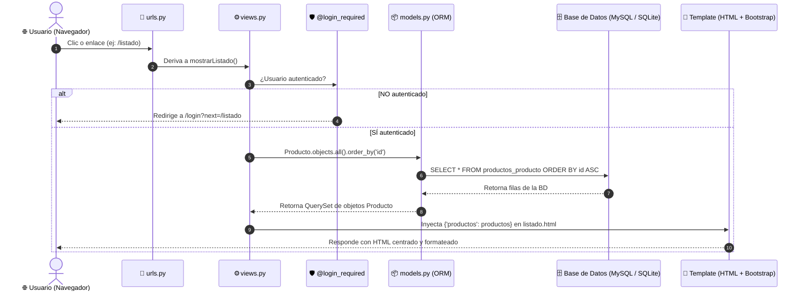
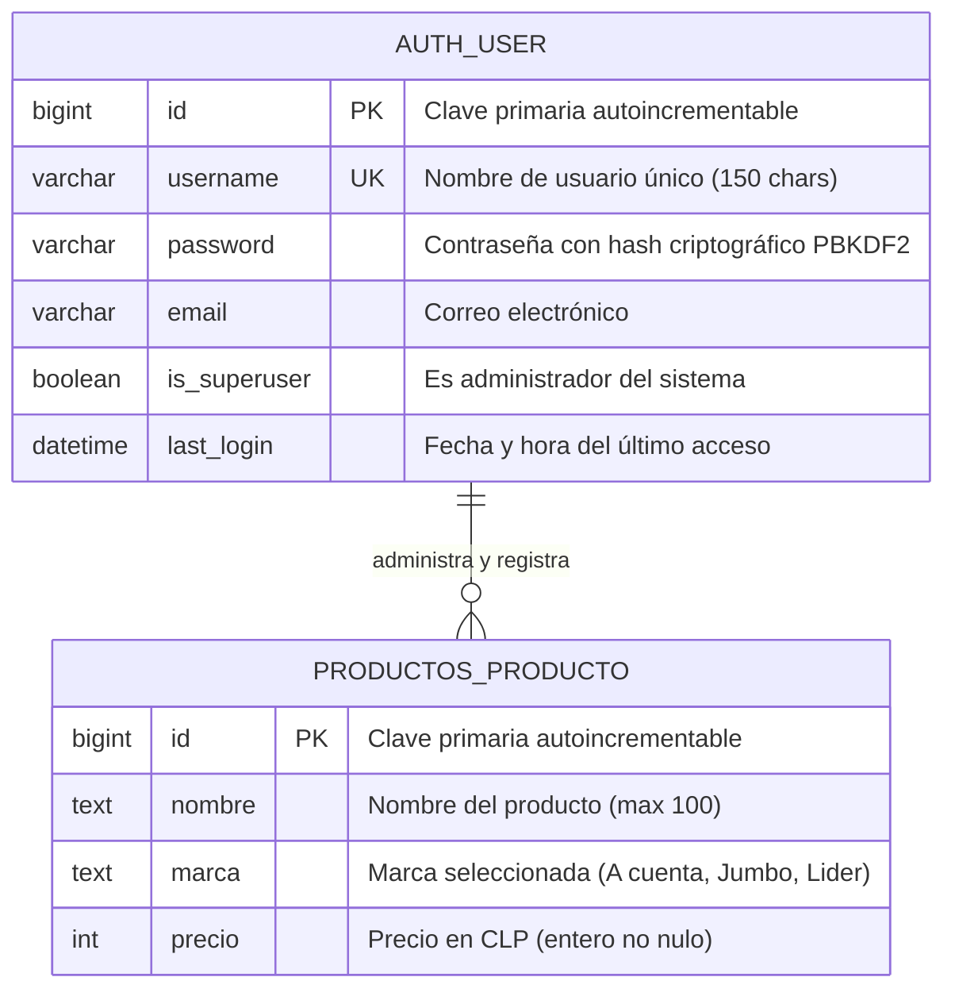
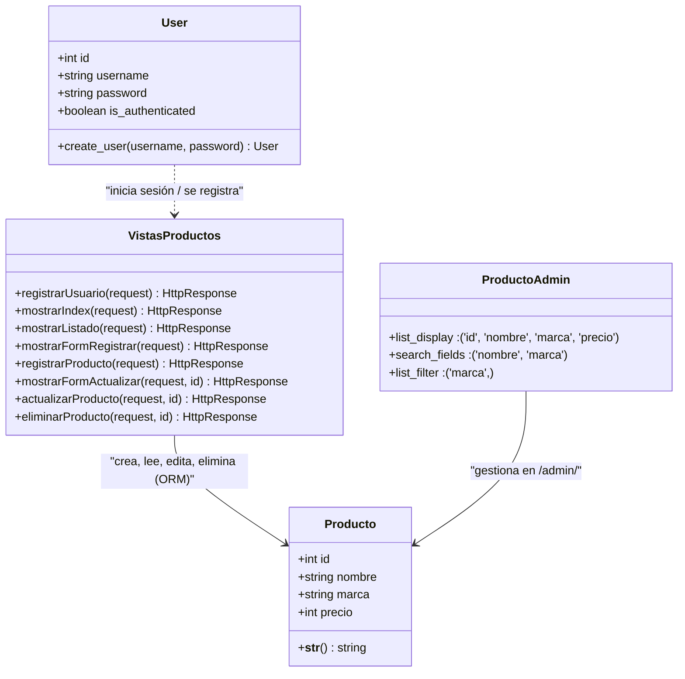
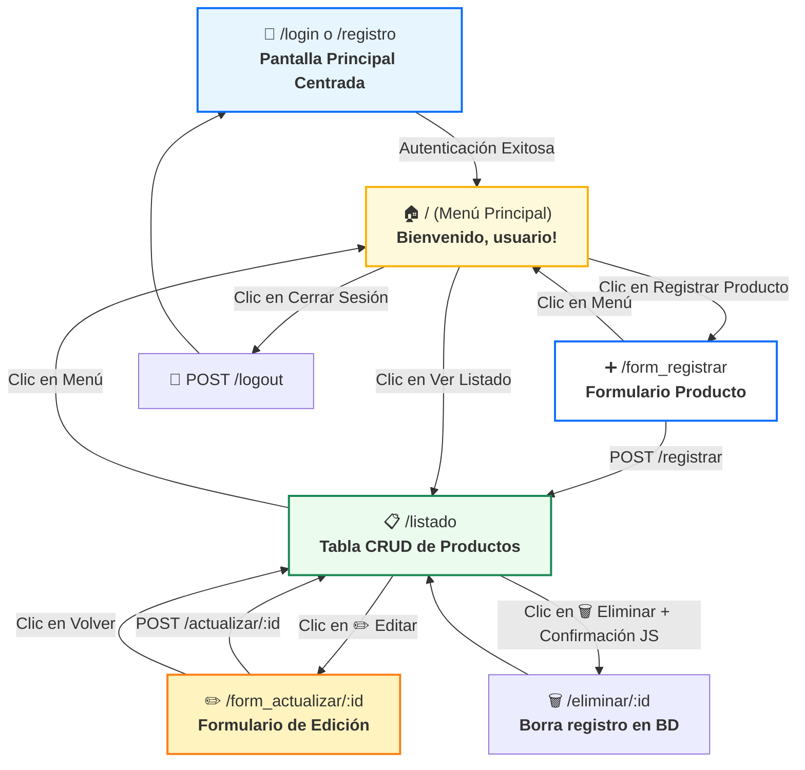
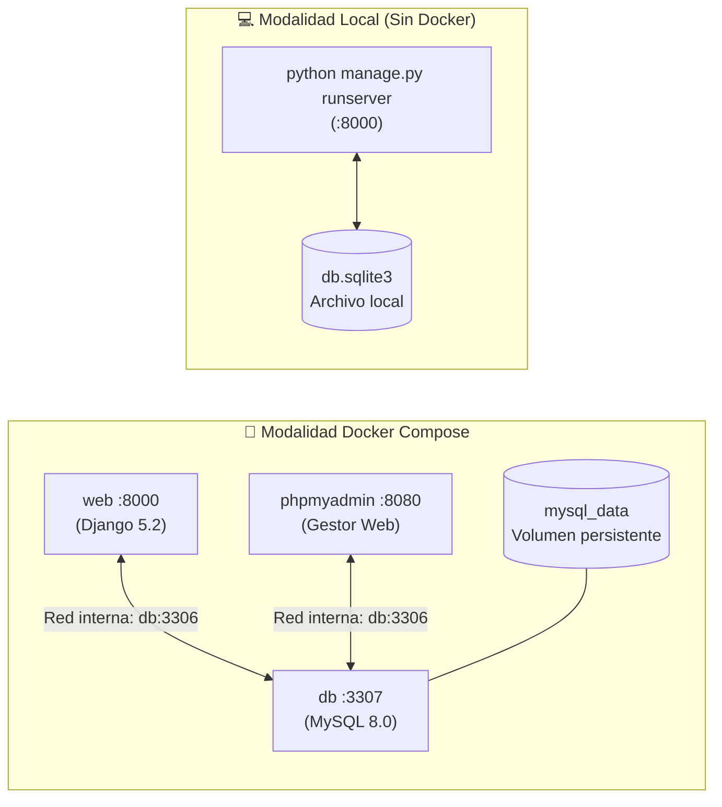

# 🗺️ Guía Visual: Diagramas de Flujo y Arquitectura
**Proyecto_BD (Django + MySQL / SQLite + Docker)**  
*Documento de apoyo visual especialmente diseñado para estudio neurodivergente (esquemas visuales, mapas de navegación y diagramas de flujo).*

---

## 1. Ciclo de Vida de una Petición (Arquitectura MVT)

---

## 2. Diagrama Entidad - Relación (DER)

---

## 3. Diagrama de Clases UML

---

## 4. Mapa Mental de Navegación (Sitemap del Usuario)

---

## 5. Infraestructura: Docker vs Modo Local

---

### 📌 Archivo PDF para descargar e imprimir
Encuentra la versión PDF de alta calidad con gráficos vectoriales en:  
👉 **`DIAGRAMAS_Y_FLUJO_VISUAL.pdf`**
