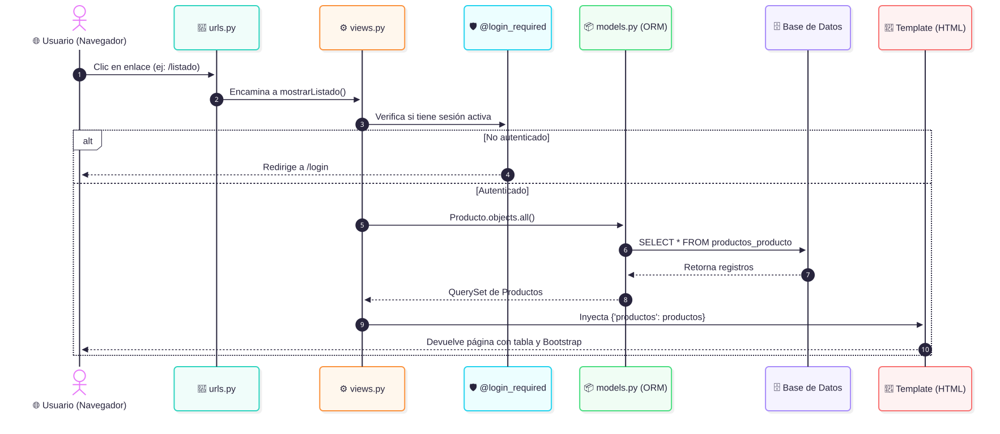

<!-- _class: lead -->
# 🗺️ GUÍA VISUAL DE ESTUDIO
### Evaluación Sumativa N° 2 (35%) · Programación Back End
**INACAP Sede Maipú · Primavera 2026**

  👤 <b>Estudiante:</b> Alexis Ferrada 
  👨‍🏫 <b>Docente:</b> Javier Eduardo Gutiérrez Osorio 
  🎯 <b>Puntaje Interrogación:</b> 30 Puntos (Explicación del Código) 
  📦 <b>Proyecto:</b> <code>Proyecto_BD</code> (Django 5.2 + MySQL / SQLite + Docker)

---

## 1. Ciclo de Vida de una Petición (Arquitectura MVT)

  <b>¿Cómo viaja la información?</b> El usuario solicita una URL ➔ <code>urls.py</code> deriva a <code>views.py</code> ➔ <code>@login_required</code> valida sesión ➔ El ORM consulta a la Base de Datos ➔ La vista inyecta los datos en el Template HTML ➔ Se muestra en pantalla.

---

## 2. Estructura de la Base de Datos (Diagrama Entidad-Relación)

  <b>Dos tablas principales:</b> <code>auth_user</code> (creada automáticamente para autenticación y login) y <code>productos_producto</code> (creada con el modelo Producto para el CRUD).

---

## 3. Diagrama de Clases y Controladores (UML)

  <b>Estructura de Objetos:</b> <code>Producto</code> define los datos y se registra en <code>ProductoAdmin</code>. Las vistas funcionales controlan las operaciones CRUD llamando al ORM de Django.

---

## 4. Mapa Mental de Navegación (Sitemap de Pantallas)

  <b>Flujo de usuario:</b> La pantalla principal unifica Login y Registro ➔ Al ingresar entra al Menú Principal ➔ Desde allí se accede a Registrar Producto o Listado ➔ Editar y Eliminar retornan siempre al Listado.

---

## 5. Arquitectura de Despliegue: Docker vs Modo Local

  <h3 style="color: #1864ab; margin-top: 0; font-size: 1.1rem;">🐳 Modalidad Docker Compose</h3>
  <ul>
    <li><b>Contenedor Web (:8000):</b> Django 5.2 sobre Python 3.12.</li>
    <li><b>Contenedor BD (:3307):</b> Servidor MySQL 8.0 con healthcheck.</li>
    <li><b>Contenedor phpMyAdmin (:8080):</b> Interfaz visual de gestión.</li>
    <li><b>Volumen persistente:</b> <code>mysql_data</code> guarda los datos aunque se apague el contenedor.</li>
    <li><b>Red interna:</b> Los servicios se comunican usando el nombre de host <code>db:3306</code>.</li>
  </ul>

  <h3 style="color: #2b8a3e; margin-top: 0; font-size: 1.1rem;">💻 Modalidad Local (Sin Docker)</h3>
  <ul>
    <li><b>Motor:</b> SQLite3 (archivo <code>db.sqlite3</code>).</li>
    <li><b>Recomendado en la pauta:</b> No requiere instalar MySQL ni encender servicios adicionales.</li>
    <li><b>Activación automática:</b> Si no existe la variable <code>DB_HOST</code>, Django activa SQLite de forma transparente.</li>
    <li><b>Comando directo:</b>
      <code>python manage.py migrate</code> 
      <code>python manage.py runserver</code>
    </li>
  </ul>

---

## 6. Tarjeta Rápida para la Interrogación (30 Puntos)

| Pregunta del Profesor | Respuesta Exacta y Concisa |
| :--- | :--- |
| **¿Qué es el ORM?** | El mapeador de objetos de Django. Traduce clases y métodos Python (<code>.all()</code>, <code>.create()</code>, <code>.delete()</code>) a SQL sin escribir consultas a mano y previene inyecciones SQL. |
| **¿Cómo se protegen las rutas?** | Con el decorador <code>@login_required</code> arriba de cada vista. Si el usuario no tiene sesión activa, lo envía a <code>/login</code>. |
| **¿Para qué sirve <code></code>?** | Protege los formularios POST contra falsificación de petición en sitios cruzados mediante un token criptográfico único. |
| **¿Diferencia entre <code>render</code> y <code>redirect</code>?** | <code>render()</code> procesa y muestra un template HTML en la misma petición; <code>redirect()</code> responde con un código HTTP 302 hacia otra URL. |
| **¿Cómo se guardan las contraseñas?** | Con <code>User.objects.create_user()</code>, aplicando hash PBKDF2 con SHA-256. Nunca en texto plano. |

  ✅ <b>¡Éxito en tu interrogación, Alexis! Toda la arquitectura está respaldada en este repositorio.</b>

